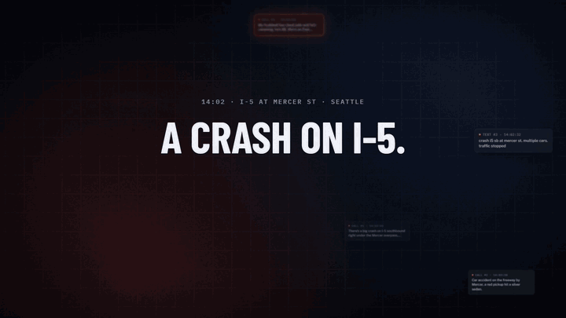

# Triage Lens

**Live demo: [spencerhurst.com/triage-lens](https://spencerhurst.com/triage-lens/)**

[](https://spencerhurst.com/triage-lens/launch.mp4)

▶ **[Watch the full launch video with sound (52 s)](https://spencerhurst.com/triage-lens/launch.mp4)** · [download MP4](media/triage-lens-launch.mp4)

After an incident, emergency call volume spikes. Many of the calls describe the same event, and the one call that matters most can get buried. Triage Lens folds duplicate reports into a single incident and ranks every incident by an explainable urgency score, so the most dangerous cases reach a dispatcher first.

Built in 45 minutes at a hackathon on incident and emergency response.

## What the demo shows

A replay of a simulated surge after a multi-car pileup on I-5 at the Mercer St overpass in Seattle, mixed with unrelated calls across the city:

- **34 reports become 7 incidents.** The 25 crash reports fold into one incident.
- **Duplicates can escalate.** A Spanish-language call saying a man is trapped ("atrapado") raises the crash from P2 to P1, and the incident shows which report did it.
- **Nearby is not the same as duplicate.** A chest-pain call 245 m from the crash stays its own P1 incident instead of being swallowed by the pileup.
- **Unclear matches go to a person.** A northbound crash about 290 m away is flagged for review because it is on the opposite side of the freeway.
- **Stress test:** 10,000 synthetic reports processed in the browser in well under a second, with the duplicate-catch rate and wrong-merge rate measured against known answers.

## How it works

1. **Listen.** Speech-to-text transcribes each call. The system extracts the type of emergency, the place named, identifying details (colors, vehicles, direction of travel), danger words in English and Spanish, and a voice-stress reading.
2. **Match.** Each report is scored against open incidents nearby: 45% distance (adjusted for location accuracy), 15% time, 25% emergency type, 15% shared details.
   - A score of 0.70 or more links automatically, and a dispatcher can split it out in one click.
   - 0.50 to 0.69 is kept separate and sent to a person for review.
   - Different emergency types never merge.
3. **Score urgency (0–100).** Danger words 50%, caller distress 20%, vulnerable people 15%, report surge 15%. Score bands set the priority: 70+ is P1, 45+ is P2, 25+ is P3. Hard rules also apply: "not breathing", "trapped", "people inside" or a weapon always mean P1. A calm voice never lowers priority.
4. **Never ignore a duplicate.** Every new report on a known incident is still read. If it adds danger, the whole incident moves up.

**Scale:** incidents are stored in 1 km grid cells, so each report is compared only with nearby open incidents, and the work per report stays the same as call volume grows.

## Run it locally

```sh
python3 -m http.server 8000
# open http://localhost:8000
```

Live microphone transcription (the **Speak** button) uses the browser's Web Speech API and works in Chrome or Edge.

## Files

| Path | What it is |
|---|---|
| `engine.js` | Matching and scoring engine, scenario data and stress test. No DOM, so it also runs in Node. |
| `page.html` | The interface. Edit this, then run `python3 build.py`. |
| `index.html` | Built page (generated by `build.py`). |
| `tiles/` | Pre-rendered basemap images for the demo area: street, dark, satellite and road labels. |
| `vendor/leaflet.css` | Leaflet stylesheet, inlined at build time. |
| `media/` | Launch video and the README preview. |

## Data and credits

- Map: [Leaflet](https://leafletjs.com). Basemap © Esri, HERE, Garmin, USGS, © OpenStreetMap contributors. Imagery © Esri, Maxar, Earthstar Geographics.
- Road positions for the scenario come from OpenStreetMap.
- All calls are fictional.
